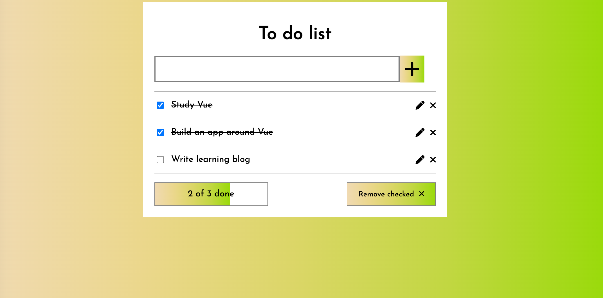
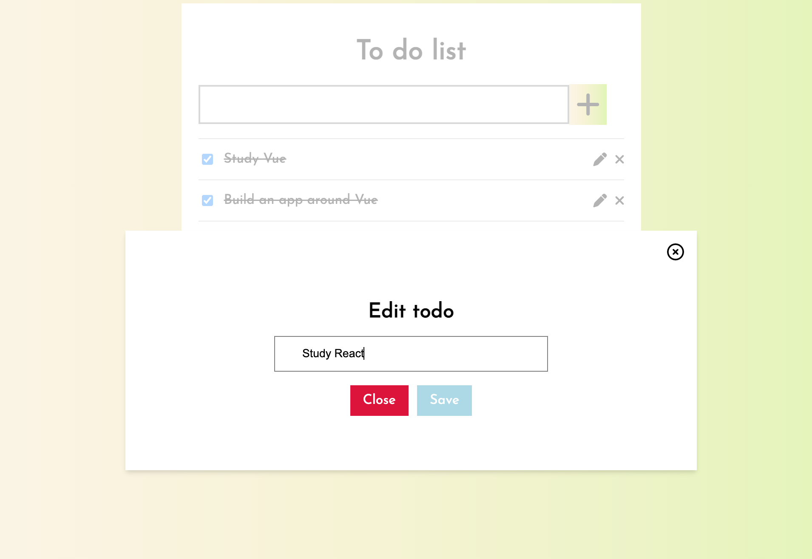

# Todo list in Vue :cowboy_hat_face:

### Table of Contents

- [Description](#description)
- [Technologies](#technologies)
- [What I learned](#what-i-learned)
- [License](#license)
- [Author Info](#get-in-touch)

---

## Description

First Vue project! All code are original.

The app can be accessed at the link below.

> https://ran-todo-list.netlify.app

---

## Technologies

- Frontend: Vue, JavaScript, HTML & CSS

---

## License

MIT License

---

## Get in touch

  <a href="https://www.instagram.com/ranwren/">
    
@ranwren

    
  </a>
<a href="https://www.linkedin.com/in/ding-ran/">
  
@Ran Ding

    
  </a>

[Back To The Top](#)
